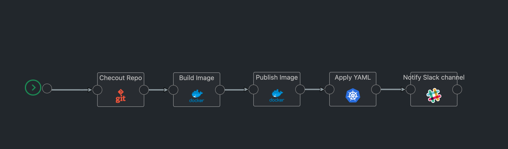

# General

This locations is for gcp templates, the ones that you can use for gcp environment.

## Table of contents

* [app-demo-deploy-with-gke](#app-demo-deploy)

## Simple Application Deployment on K8s

This template is for deploying a demo application to a kaholo.io account. We're asssuming your app is containerized and has Dockerfile in your repo and k8s deployment yaml file.



### Configuration variables

* **env**: The environment where the app will be deployed.
* **working_dir**: The directory where the agent will work to deploy your app.
* **git_source**: The repository source.
* **git_branch**: The branch where the code is located.
* **k8s_yamlFile**: The file path with extension of the k8s deployment yaml file.
* **k8s_namespace**: The namespace where the deployment will be deployed.
* **k8s_serviceAccountName**: The service account where the deployment will be deployed.
* **docker_image_name**: Docker Image name.
* **docker_image_tag**: Docker Image tag.

Example:

```javascript
{
  "env" : "prd",
  "working_dir": "/kaholo-demo-gke-deployment",
  "git_source": "brunoscota/kaholo-demo-gke-deployment.git",
  "git_branch": "main",
  "k8s_yamlFile": "k8s.deployment.yaml",
  "k8s_endpointURL": "https://35.185.6.127",
  "k8s_namespace": "default",
  "docker_image_name": "brunoscota/kaholo-demo",
  "docker_image_tag": "latest"
}
```


### Vault secrets

* **slack_access_token**: The slack access token.
* **k8s_clusterCACertificate**: The k8s cluster ca certificate.
* **k8s_token**: The k8s access token.
* **docker_password**: The docker registry password to push the images.
* **gcp_kaholo_key**: The gcp service account key.
